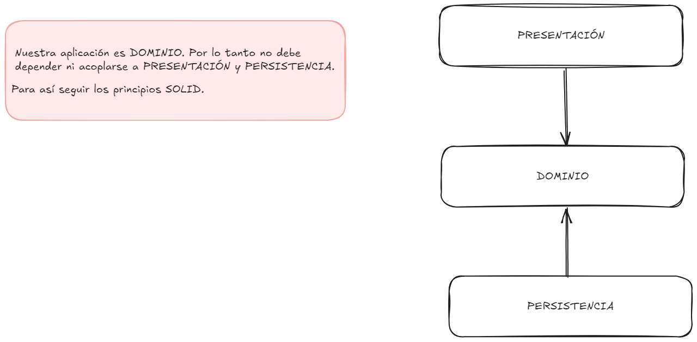

# ARQUITECTURA POR CAPAS

## ¿Qué es?

La arquitectura en capas es un modelo de diseño de software, cuya base es la separación de las diferentes funcionalidades del sistema en capas o niveles, donde cada capa se encarga de un conjunto de tareas específicas y se comunica con los niveles adyacentes mediante interfaces bien definidas.

## Componentes:

- **PRESENTATION**: Maneja las solicitudes del usuario y coordina la lógica de presentación. Se comunica con la capa de dominio para obtener los datos y realizar operaciones.

- **DOMAIN**: Reside la lógica de la aplicación. Contiene las reglas y operaciones que definen como funciona el sistema. Las entidades y servicios en esta capa representan los conceptos centrales de la aplicación.

- **REPOSITORY**: Se encarga de interactuar con el almacén de datos, una base de datos por ejemplo. Proporciona métodos para acceder y manipular los datos de manera abstracta, ocultando los detalles de implementación específicos.

