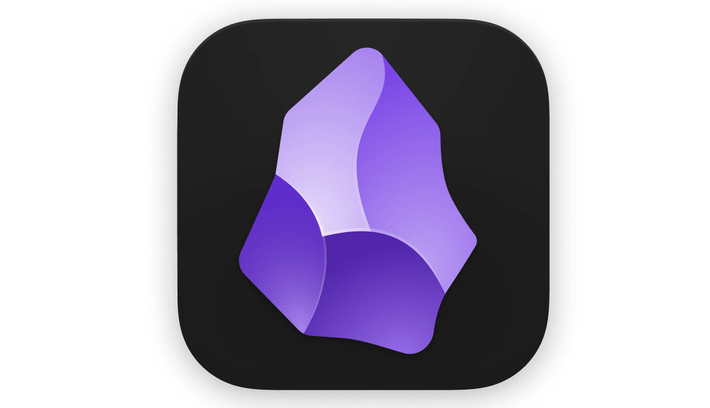

# REPOSITORIO PARA LOS APUNTES DE 2º DE DAW

## Asignaturas:

### Desarrollo Web En Entorno Servidor __(DWS)__
*Temario* --> [Cesguiro](https://cesguiro.es/doku.php/clase/daw/dws/start)

 

### Desarrollo Web En Entorno Cliente __(DWC)__
*Temario* --> [Aules](https://aules.edu.gva.es/fp/course/view.php?id=137179)

-  1a Evaluación

    - [Tema 1 JS Arquitecturas y tecnologías programación Web en cliente](./2-Desarrollo%20Web%20En%20Entorno%20Cliente/.temario/1a%20Evaluacion/Tema%201%20JS%20Arquitecturas%20y%20tecnologías%20programación%20Web%20en%20cliente.pdf)

    - [Tema 2 JS Sintaxis del lenguaje](./2-Desarrollo%20Web%20En%20Entorno%20Cliente/.temario/1a%20Evaluacion/Tema%202%20JS%20Sintaxis%20del%20lenguaje.pdf)

    - [Tema 3 JS Objetos predefinidos](./2-Desarrollo%20Web%20En%20Entorno%20Cliente/.temario/1a%20Evaluacion/Tema%203%20JS%20Objetos%20predefinidos.pdf)

    - [Tema 4 JS Estructuras definidas por el usuario](./2-Desarrollo%20Web%20En%20Entorno%20Cliente/.temario/1a%20Evaluacion/Tema%204%20JS%20Estructuras%20definidas%20por%20el%20usuario.pdf)

    - [Tema 5 JS Eventos](./2-Desarrollo%20Web%20En%20Entorno%20Cliente/.temario/1a%20Evaluacion/Tema%205%20JS%20Eventos.pdf)

 

### Diseño De Interfaces Web __(DIW)__
*Temario* --> [Logongas DIW](https://logongas.es/doku.php?id=clase:daw:diw:start)

 

### Despliegue De Apliaciones Web __(DAW)__
*Temario* --> [Logongas DAW](https://logongas.es/doku.php?id=clase:daw:daw:start)

 

---

 

> Herramienta utilizada para tomar apuntes __Obsidian__. Es una aplicación de toma de notas que se basa en el concepto de "segundo cerebro". Permite a los usuarios crear y organizar notas interconectadas de manera intuitiva. Además, ofrece diversas herramientas para personalizar la apariencia y la funcionalidad, como plantillas y plugins.

    

